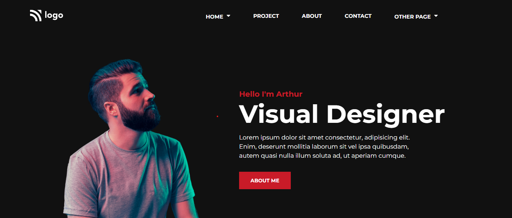

  
  
  

### Skills Gained from this
- Navbar using flexbox.
- Elements positioning using CSS grid, flexbox property.
- Placing HTML elements using CSS position along with z-index property.

### Screenshot

