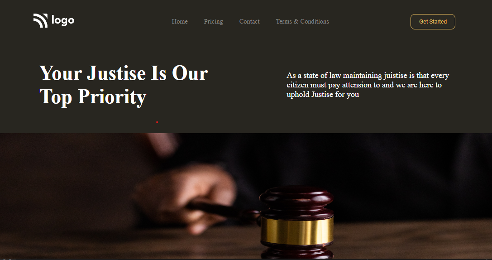

  
  

### Skills Gained from this
- attribute selector in css
- postioning of fixed inage
- Navbar using CSS flexbox.
<!-- - Elements positioning uisng CSS position property.
- Class, Tag based selection of HTML elements. -->

### Screenshot

