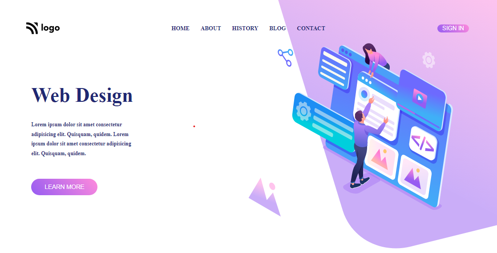

  
  

### Skills Gained from this
- Navbar and Hero section using CSS flexbox.
- Absolute positioning of image.
- Gradient backgroud for buttons
- Adding backgroud image to image element.

### Screenshot

